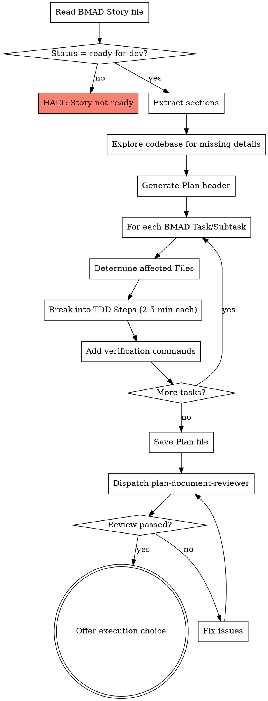

# BMAD Story to Superpowers Plan

## Overview

Convert a BMAD-METHOD Story into a superpowers-compatible implementation plan. BMAD Stories contain rich context (architecture constraints, file path recommendations, implementation guardrails) but lack the bite-sized TDD steps that superpowers agents need for execution.

**Core principle:** Don't reinvent — restructure. BMAD already did the thinking; this skill reorganizes it into executable steps.

**Announce at start:** "I'm using the bmad-story-to-plan skill to convert this BMAD Story into an implementation plan."

## When to Use

- You have a BMAD-METHOD story file with `Status: ready-for-dev`
- The story was created by BMAD's `bmad-create-story` workflow
- You want to execute the story using superpowers' `subagent-driven-development` or `executing-plans`

## When NOT to Use

- The story is NOT in `ready-for-dev` status
- You have a plain requirements doc (use `brainstorming` → `writing-plans` instead)
- The story was already converted to a plan

## The Process



## Step 1: Parse BMAD Story

Read the story file and extract these sections:

| Section | What to extract |
|---------|----------------|
| **Story** | Role, action, benefit (becomes Plan Goal) |
| **Acceptance Criteria** | BDD scenarios → test case foundations |
| **Tasks / Subtasks** | The work items to convert into Plan Tasks |
| **Dev Notes** | Architecture constraints, recommended file paths, implementation guardrails, testing standards |
| **Dev Notes > Recommended File Paths** | File path table → Plan Task `Files:` sections |
| **Dev Notes > Architecture Constraints** | Constraints to embed in Plan context |
| **Dev Notes > Implementation Guardrails** | Critical warnings to include in relevant Task steps |
| **Dev Notes > Reusable Assets** | Patterns/code to reference in implementation steps |

**See** `story-format-reference.md` for the complete BMAD Story structure.

## Step 2: Explore Codebase

Use Dev Notes file paths and architecture constraints to:
1. Verify recommended file paths exist or confirm they're new files
2. Check existing code patterns in related files
3. Identify test framework setup, import conventions, build tooling
4. Find existing tests to understand assertion patterns

This fills gaps the Story doesn't cover: exact import paths, existing function signatures, test helpers.

## Step 3: Generate Plan Header

```markdown
# [Story Title] Implementation Plan

> **For agentic workers:** REQUIRED SUB-SKILL: Use superpowers:subagent-driven-development (recommended) or superpowers:executing-plans to implement this plan task-by-task. Steps use checkbox (`- [ ]`) syntax for tracking.

**Goal:** [From Story section: "As a X, I want Y, so that Z" — condensed to one sentence]

**Architecture:** [From Dev Notes architecture constraints — 2-3 sentences]

**Tech Stack:** [From Dev Notes technical baseline]

**BMAD Story:** `[path-to-story-file]` (reference for full context)

**Acceptance Criteria:**
[Copy the BDD-format ACs from Story — these are the ultimate validation targets]

**Critical Implementation Guardrails:**
[Extract key warnings from Dev Notes implementation guardrails]

---
```

## Step 4: Convert Each Task to Plan Tasks

For each BMAD Task and its Subtasks, generate a Plan Task following this mapping:

### Mapping Rule: BMAD Subtask → Plan Task

Each BMAD **Subtask** (e.g., "1.1 Create `src/db/connection.ts`") becomes one Plan **Task**. Group multiple trivially small Subtasks into one Task only if they touch the same file.

### Task Structure

````markdown
### Task N: [Subtask description, simplified]

**Files:**
- Create: `exact/path/from/dev-notes.ts`
- Modify: `exact/path/to/existing.ts`
- Test: `exact/path/to/test-file.test.ts`

**Context from BMAD Story:**
[Relevant architecture constraints, guardrails, or previous Story learnings that apply to THIS specific task. Keep brief — only what the implementer needs.]

- [ ] **Step 1: Write the failing test**

```typescript
// Test skeleton derived from AC + Dev Notes testing standards
describe('component under test', () => {
  it('should [behavior from AC]', () => {
    // Arrange
    // Act
    // Assert
  });
});
```

- [ ] **Step 2: Run test to verify it fails**

Run: `[test command from Dev Notes testing standards]`
Expected: FAIL with "[expected error]"

- [ ] **Step 3: Write minimal implementation**

```typescript
// Implementation guided by Dev Notes constraints
```

- [ ] **Step 4: Run test to verify it passes**

Run: `[same test command]`
Expected: PASS

- [ ] **Step 5: Commit**

```bash
git add [files]
git commit -m "[conventional commit message]"
```
````

### When a BMAD Task has no testable behavior

Some tasks are structural (e.g., "update index.ts exports") or validation-only (e.g., "run pnpm build"). For these, skip the TDD cycle and use direct steps:

```markdown
- [ ] **Step 1: [Direct action]**
- [ ] **Step 2: Verify**
  Run: `[command]`
  Expected: [result]
- [ ] **Step 3: Commit**
```

## Step 5: Map Acceptance Criteria to Verification

After all implementation tasks, add a final verification task:

```markdown
### Task [Final]: End-to-End Verification

**Context:** Validate all BMAD Acceptance Criteria are satisfied.

- [ ] **Step 1: Run full test suite**
  Run: `[build + test commands from Dev Notes]`
  Expected: All tests pass, no regressions

- [ ] **Step 2: Verify AC #1** — [AC description]
  [Specific verification steps]

- [ ] **Step 3: Verify AC #2** — [AC description]
  [Specific verification steps]

...

- [ ] **Step N: Commit final state**
```

## Step 6: Save and Review

**Save plan to:** `docs/superpowers/plans/YYYY-MM-DD-[story-key].md`
- (User preferences for plan location override this default)

**Review loop:**
1. Dispatch a plan-document-reviewer subagent (from superpowers:writing-plans) with the plan path and original BMAD Story path as context
2. If ❌ Issues Found: fix and re-dispatch
3. If ✅ Approved: proceed to execution handoff
4. Max 3 iterations, then surface to human

## Step 7: Execution Handoff

**"Plan complete and saved to `[path]`. Two execution options:**

**1. Subagent-Driven (recommended)** — I dispatch a fresh subagent per task, review between tasks, fast iteration

**2. Inline Execution** — Execute tasks in this session using executing-plans, batch execution with checkpoints

**Which approach?"**

**If Subagent-Driven chosen:**
- **REQUIRED SUB-SKILL:** Use superpowers:subagent-driven-development

**If Inline Execution chosen:**
- **REQUIRED SUB-SKILL:** Use superpowers:executing-plans

## Task Granularity Guide

| BMAD Subtask type | Plan treatment |
|-------------------|---------------|
| New file with logic | Full TDD task: test → fail → implement → pass → commit |
| New file (config/schema/SQL) | Direct steps: create → verify → commit |
| Modify existing file (add export) | Direct steps: modify → verify build → commit |
| Performance/benchmark task | Direct steps: run benchmark → record results → commit |
| Verification-only task | Verification steps: run commands → assert results |

## Integration

**This skill replaces:**
- `superpowers:brainstorming` — BMAD already completed requirements exploration
- `superpowers:writing-plans` — this skill IS the plan writing (adapted for BMAD input)

**This skill feeds into:**
- `superpowers:subagent-driven-development` — primary execution path
- `superpowers:executing-plans` — alternative execution path
- `superpowers:finishing-a-development-branch` — after all tasks complete

## Red Flags

| Thought | Reality |
|---------|---------|
| "The Story is detailed enough, skip plan" | superpowers agents need Step-level granularity. Always convert. |
| "I'll just follow the Story Tasks directly" | Story Tasks lack TDD cycle, exact commands, and code. Convert first. |
| "Dev Notes are just suggestions" | Dev Notes contain MUST-follow constraints (architecture, naming, boundaries). |
| "I can skip codebase exploration" | Story file paths may be outdated. Always verify against current code. |
| "Performance tasks need TDD too" | Benchmarks aren't TDD. Use direct steps with clear metrics. |
